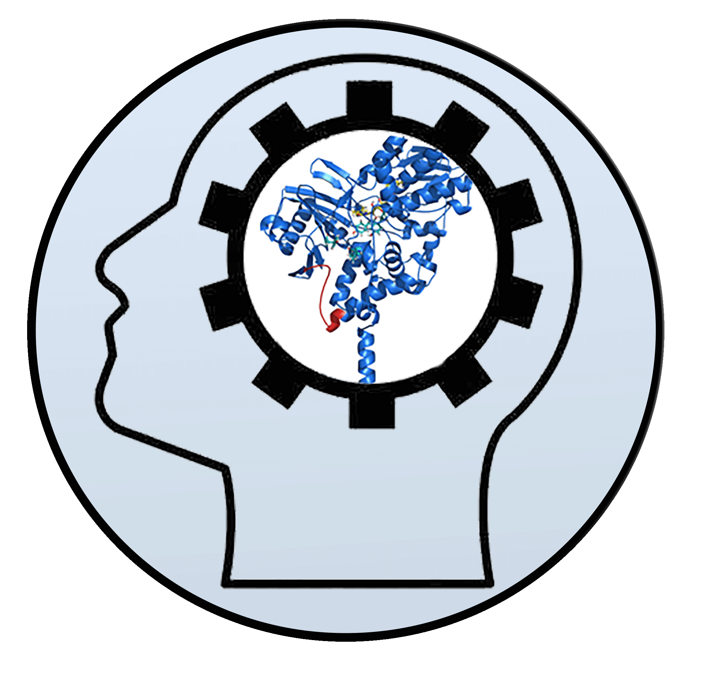

### Project status: ON GOING


# Cheminformatics - Machine Learning MAO-A project



## Overview

Monoamine oxidase (MAO) is a flavoenzyme found on the membrane surface of mitochondria in brain cells. Its main function is to degrade monoamine compounds preferentially from the central nervous system, such as the neurotransmitters serotonin and dopamine.  Two isoforms exists (A and B) which share 70% of their same amino acid sequence. To date, several studies reveal that MAO-A is involved in disorders such as depression, while MAO-B is related to neurodegenerative disorders such as Parkinson's and Alzheimer's diseases. Monoamine oxidase inhibitors (MAOIs) are substances with high interest in their potential applicability in psychiatric and neurodegenerative diseases, especially depression.  More than 350 million people worldwide suffer from depression.

However, there is considerable diversity in the chemical structures of iMAOs and their use as pharmacological agents. The use of these compounds has declined over time due to their side effects. Research on MAOIs is relevant to obtain selective treatments for depression and neurodegenerative diseases in order to develop multi-targeted inhibitors that fulfil more than one function, such as dual-receptor inhibition or neuroprotection.

In this project I performed exploratory analysis on MAO-A ligand dataset from CheMBL, and I used to perform Machine Learning (ML) and Deep Learning (DL) training.


## 1. Setup

Python libraries used:

- Pandas
- RDkit
- datamol
- Numpy
- Sklearn
- Seaborn
- Matplotlib
- Pickle
- Pycm

The set up can be easily done with conda enviroments using the YAML file.

```
conda env create -f ChemBioML_env.yaml
```


## 2. Inputs

The complete data set for MAO-A was obtained from ChemMBL can be found here:

[MAO-A data set](https://www.ebi.ac.uk/chembl/g/#browse/activities/filter/target_chembl_id%3ACHEMBL1951)

## 3. Repository Structure

### 1_Exploratory_Analysis

In this directory you will find the first steps taken to cleand and apply a structural exploratory analysis of the MAO-A data set of CheMBL.

### 2_RandomForest_ML

In this project I used the dataframes obtained in the exploratory analysis to train a Random Forest model and make predictions. I obtained a model with  Area Under the Receiver Operating Characteristic Curve (ROC AUC).

### 3_CNN_DL


